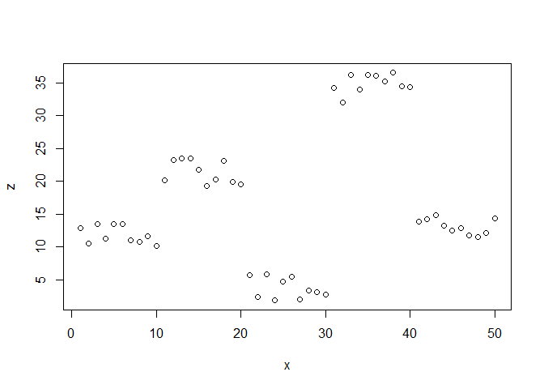
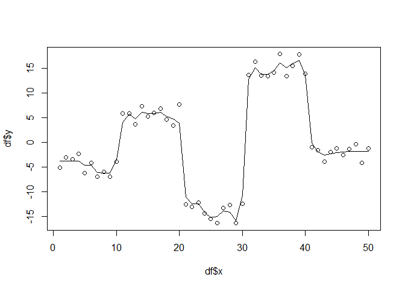
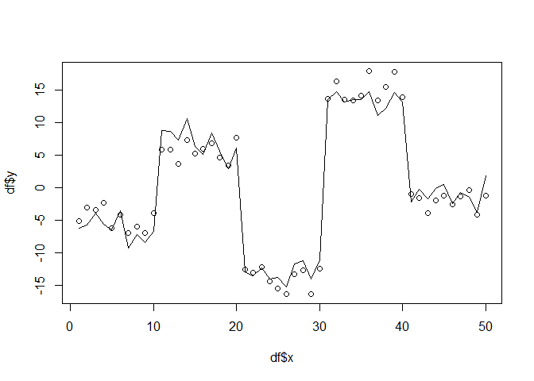
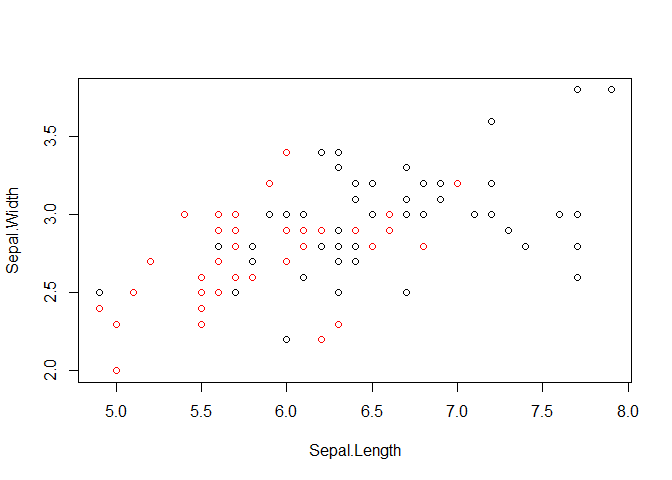
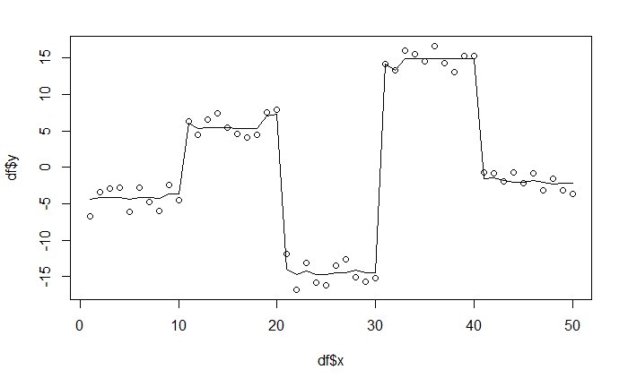
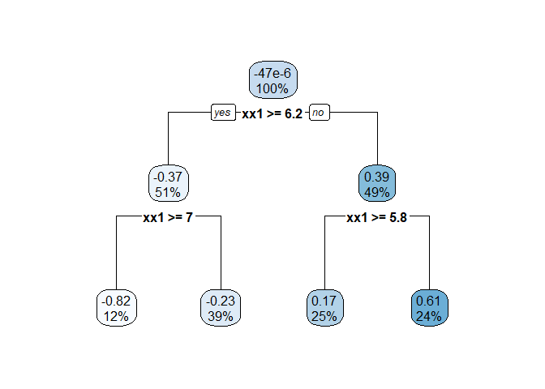

# gradient boosting custom :)


Simple dataset for regression example

```r
# Simple example for regression tree
x = 1:50
y1 = runif(10,max= 15,min=10)
y2 = runif(10,max=25,min=20)
y3 = runif(10,max=5,min=0)
y4 = runif(10,max=35,min=30)
y5 = runif(10,max=17,min=13)
y=c(y1,y2,y3,y4,y5)
y <- scale(y,scale = F)

z1 = runif(10,max=14,min=9)
z2 = runif(10,max=24,min=19)
z3 = runif(10,max=6,min=1)
z4 = runif(10,max=37,min=32)
z5 = runif(10,max=15,min=11)
z = c(z1,z2,z3,z4,z5)

x = cbind(x,z)
plot(x)
```

<!-- -->

```r
df = as.data.frame(cbind(x,y))
names(df) <- c("x","z","y")
regression = T
```


The following snipped demonstrates the simple idea of boosting in a regression example without really considering the friedmann paper.

```r
set.seed(1234)

library(rpart)

alpha=.05 # learning rate, slows overfitting rate
n = length(df$x) # subsampling length

YP = 0 # Our starting function f(x) = 0

df$yr=df$y # Initial residuals are the actual values


for(t in 1:400){
  index = sample(1:n,size=n,replace=TRUE)
  fit=rpart(yr~x,data=df[index,],control = list(maxdepth = 2),method='anova') #fit a regression tree
  yp=alpha*predict(fit,newdata=df) #shrink by learning rate
  df$yr=df$yr - yp #subtract residuals
  YP = YP + yp #add residual model to total model
}

plot(df$x,df$y)
lines(df$x,YP)
```

<!-- -->

Comparison by using gbm library


```r
library(gbm)
```

```
## Loading required package: survival
```

```
## Loading required package: lattice
```

```
## Loading required package: splines
```

```
## Loading required package: parallel
```

```
## Loaded gbm 2.1.3
```

```r
gbmModel = gbm(y~., data = df,n.trees = 400,shrinkage = 0.05,distribution = "gaussian")
# distribution specifies the error function here
# e.g. gaussian = squared error, laplace = absolute 


gbmPredictions = predict(gbmModel,newdata = df,n.trees=400,type = "response")
plot(df$x,df$y)
lines(df$x,gbmPredictions)
```

<!-- -->


Classification dataset

```r
data("iris")

df <- iris[51:150,c("Sepal.Length","Sepal.Width","Species")]

df$Species = ifelse(df$Species=='versicolor',1,-1)
plot(df[,1:2],col=factor(df[,3]))
```

<!-- -->

```r
colnames(df) <- c("x1","x2","y")
regression = F
```


Gradient boosting for both regression and classification in one function. 
! Important notice: The classification part is kind of a hack, as i am not 100% certain the estimated probabilities correspond to actual probabilities (at least they are distributed from 0-1 and look like probabilities ;)). This also only works for binary classification.

```r
set.seed(1234)

library(rpart)

# only set to T if using the first dataset, set to F if using the second dataset.
# listed here again but set at each dataset loading as well...
# regression = F


Y = df$y
data = df
data$y <- NULL
data = as.matrix(data)

n_estimators = 400
learning_rate = 0.05
min_samples_split=2
max_depth = 2

# 

# derivative of square loss (simplified)
squareLossGradient <- function(y,y_pred){
  return( y-y_pred)
}

#based on friedmann two-class classification algorithm
L2response <- function(y,y_pred){
  return(2*y/(1+exp(2*y*y_pred)))
}

fitGradientBoost <- function(x,y){
  #create a list of trees
  trees = list()
  
  #initial guess (mean)
  y_pred = rep(mean(y),length(y))
  
  if(regression){
    print("GB for regression")
    for (i in 1:n_estimators){
      #TODO for some reason i cannot do this without declasring data in the rpart model
      x = as.data.frame(x)
      #Calculate gradient (pseudo-residuals)
      x$gradient = squareLossGradient(y,y_pred)
      #fit residuals using rpart
      trees[[i]] = rpart(gradient~.,data=x,control = list(maxdepth=max_depth,minsplit=min_samples_split),method='anova')
      x$gradient = NULL
      #create predictions based on original data
      new_pred = predict(trees[[i]],newdata=x)
      #add predictions to previous prediction
      y_pred = y_pred + learning_rate*new_pred
    }
  }else{
    print("GB for classification")
    # Exact same behavior but using a different loss function
    for (i in 1:n_estimators){
      gradient = L2response(y,y_pred)
      trees[[i]] = rpart(gradient~x,control = list(maxdepth=max_depth,minsplit=min_samples_split),method = 'anova')
      new_pred = predict(trees[[i]],newdata=as.data.frame(x))
      y_pred = y_pred + learning_rate*new_pred
    }
  }
  return(trees)
}

# predict using the list of trees
predictGradientBoost <- function(trees,x){
  # initial guess is again mean
  y_pred = rep(mean(Y),length(Y))
  print("predicting...")
  for (i in 1:n_estimators){
    tmp = predict(trees[[i]],as.data.frame(x))
    y_pred = y_pred+learning_rate*tmp
  }
  # map to probabilities based on loss function
  if(!regression){ 
    y_pred = 1/(1+exp(2*y_pred))
  }
  return(y_pred)
}
```


```r
#run regression example
treeList = fitGradientBoost(data,Y)
```

```
## [1] "GB for classification"
```

```r
predictions = predictGradientBoost(treeList,data)
```

```
## [1] "predicting..."
```

```r
if(regression){
  plot(df$x,df$y)
  lines(df$x,predictions)
}
```
<!-- -->

```r
# run classification example
treeList = fitGradientBoost(data,Y)
```

```
## [1] "GB for classification"
```

```r
predictions = predictGradientBoost(treeList,data)
```

```
## [1] "predicting..."
```

```r
predictions
```

```
##        51        52        53        54        55        56        57 
## 0.6347135 0.6347135 0.6347135 0.1405701 0.6300729 0.2156944 0.6518325 
##        58        59        60        61        62        63        64 
## 0.1405701 0.6300729 0.2156944 0.1405701 0.3952801 0.2759263 0.3905186 
##        65        66        67        68        69        70        71 
## 0.2156944 0.6347135 0.2156944 0.3905186 0.3615534 0.2156944 0.3952801 
##        72        73        74        75        76        77        78 
## 0.3905186 0.6300729 0.3905186 0.6300729 0.6347135 0.6300729 0.6347135 
##        79        80        81        82        83        84        85 
## 0.3905186 0.2156944 0.1405701 0.1405701 0.3905186 0.3905186 0.2156944 
##        86        87        88        89        90        91        92 
## 0.3952801 0.6347135 0.4569232 0.2156944 0.2156944 0.2156944 0.3952801 
##        93        94        95        96        97        98        99 
## 0.3905186 0.1405701 0.2156944 0.2156944 0.2156944 0.5421315 0.2156944 
##       100       101       102       103       104       105       106 
## 0.2156944 0.6518325 0.3905186 0.8868905 0.6300729 0.6347135 0.8868905 
##       107       108       109       110       111       112       113 
## 0.2156944 0.8848724 0.6300729 0.8941620 0.6347135 0.6300729 0.6347135 
##       114       115       116       117       118       119       120 
## 0.2156944 0.3905186 0.6347135 0.6347135 0.8941620 0.8848724 0.2759263 
##       121       122       123       124       125       126       127 
## 0.6347135 0.2156944 0.8848724 0.6300729 0.6518325 0.8868905 0.5421315 
##       128       129       130       131       132       133       134 
## 0.3952801 0.6300729 0.8868905 0.8848724 0.8941620 0.6300729 0.6300729 
##       135       136       137       138       139       140       141 
## 0.3905186 0.8868905 0.6518325 0.6347135 0.3952801 0.6347135 0.6347135 
##       142       143       144       145       146       147       148 
## 0.6347135 0.3905186 0.6347135 0.6518325 0.6347135 0.6300729 0.6347135 
##       149       150 
## 0.5654967 0.3952801
```

```r
# print a sample tree
library(rpart.plot)
rpart.plot(treeList[[5]])
```

<!-- -->
